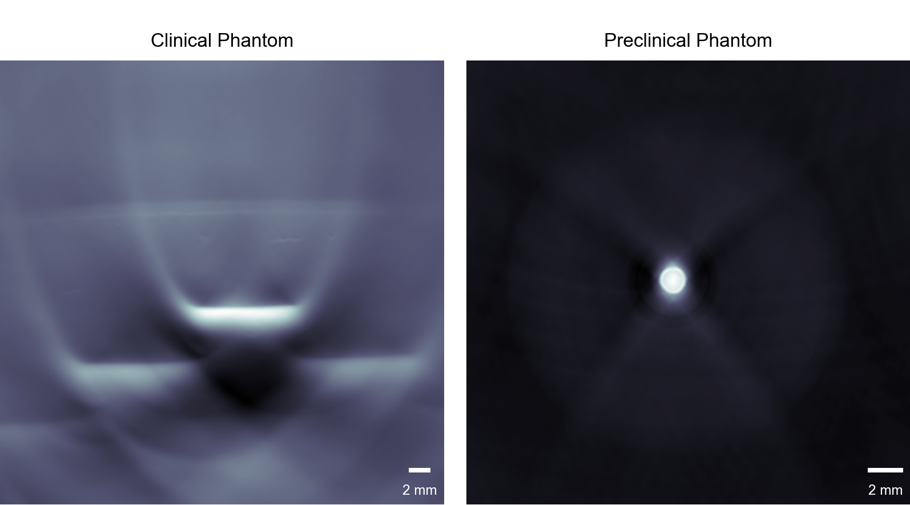

# Summary

PATATO is a toolkit for processing and analyzing tomographic photoacoustic data. It offers fast implementations of commonly-used methods, including pre-processing, reconstruction, and time-series data analysis, via a convenient command-line interface or Python API. The toolkit utilizes [JAX](https://jax.readthedocs.io/) for GPU-accelerated pre-processing and backprojection, and [NumPy](https://numpy.org/doc/stable/index.html) for less intensive algorithms and easy integration with other pipelines. PATATO can take in data from many different sources, and outputs can be saved in HDF5 format for further analysis and easy transfer to other languages like R or MATLAB. The toolkit is open-source, hosted on [GitHub](https://github.com/tomelse/patato) and [PyPi](https://pypi.org/project/patato/), and welcomes contributions, bug-reports, and feedback. Detailed examples and an API reference is available at [https://patato.readthedocs.io/en/latest/](https://patato.readthedocs.io/en/latest/).

# Statement of Need

As a relatively new field, photoacoustic imaging (PAI) often lacks standardization in image processing methods. Despite the numerous algorithms published in literature for reconstruction, spectral analysis, and post-processing, access to the underlying code is limited, making it challenging to use the most current and effective methods [@Lutzweiler2013]. This lack of transparency may hinder reproducibility and slow the adoption of new methods within the community. While other tools for photoacoustic image reconstruction and analysis have been developed, they all lack open-source code for GPU acceleration and have limited documentation, making it difficult to extend their functionality [@Lafci2022; @OKelly2021]. PATATO offers an open-source solution with accelerated reconstruction algorithms, end-to-end analysis, an easy-to-use interface, open data format integration, and an extensible structure.

Like many other imaging techniques, PAI requires multiple processing steps, many of which are computationally intensive. A typical pipeline for generating PA images includes filtering and interpolation of time-series data, delay-and-sum reconstruction, and linear spectral unmixing. The first two steps are particularly computationally intensive and require GPU implementations for efficient processing of large datasets, which can sometimes consist of thousands of frames. Additionally, the resulting images are highly sensitive to the parameters used, such as the cut-off frequency for filters, highlighting the need for efficient and transparent implementations of these algorithms to ensure consistent biological conclusions across datasets [@Shen2020]. In PATATO, these computationally intensive algorithms are implemented using JAX, a high-performance numerical computing toolkit, enabling GPU acceleration and consistent implementations between CPU and GPU [@jax2018github]. Additionally, PATATO stores all reconstruction parameters in the HDF5 file, making it straightforward to reproduce analyses.

# Example Datasets

Some example datasets are included in PATATO to demonstrate its key features and to allow benchmarking of different algorithms. Two devices were used to collect this data, a circular-array pre-clinical system (MSOT inVision, iThera Medical) and a handheld clinical PA system (MSOT Acuity, iThera Medical). The properties of the two systems are summarised below for reference. 

+------------------------------------+-------------------+-------------------------------------+
|                                    | **Pre-Clinical**  | **Clinical**                        |
+====================================+===================+=====================================+
| **Transducer Number**              | 256               | 256                                 |
+------------------------------------+-------------------+-------------------------------------+
| **Sampling Frequency (MHz)**       | 40                | 40                                  |
+------------------------------------+-------------------+-------------------------------------+
| **Transducer Coverage (degrees)**  | 125               | 270                                 |
+------------------------------------+-------------------+-------------------------------------+
| **Wavelengths (nm)**               | 660 to 1300       | 660 to 1300                         |
+------------------------------------+-------------------+-------------------------------------+
| **Example Datasets**               | Phantom           | Phantom scan and time-series scans: |
|                                    |                   | Oxygen-Enhanced (OE), and           |
|                                    |                   | Dynamic Contrast-Enhanced (DCE)     |
+------------------------------------+-------------------+-------------------------------------+

## Phantom Data

Phantom imaging data is provided for both the clinical and pre-clinical imaging systems. This can be used for the optimisation and comparison of different image reconstruction algorithms. The clinical phantom is based on a copolymer-in-oil protocol published previously [@Hacker2021]. A 'staircase' inclusion containing a tenfold higher concentration of nigrosin (a strong optical absorber) was created using a 3D-printed mould. The base material component contained 0.018% w/v nigrosin, the inclusion contained 0.18% w/v nigrosin. The preclinical phantom is an agarose phantom containing 2.1% v/v intralipid and 1.5% w/v agar [@Joseph2017]. A 40 nmol solution of indocyanine green (ICG) was injected into the tube as an inclusion.

## Oxygen Enhanced and Dynamic Contrast Enhanced Data

Examplar data is provided for oxygen enhanced (OE) and dynamic contrast enhanced (DCE) imaging. In the OE experiment, a mouse was imaged continuously under inhaled anaesthesia (1-2\% isofluorane) while breathing air. After five minutes, the breathing gas was changed to 100% oxygen. Consequently, there is an increase in the blood oxygenation, which can be measured using PAI. In the DCE experiment, a bolus of the PA contrast agent indocyanine green (ICG) was injected while imaging. The results of the analysis procedure provided by PATATO are shown below. These datasets can be accessed directly from PATATO, and this analysis can be reproduced, as [described in the documentation](https://patato.readthedocs.io/en/latest/examples). 

![An example of the time-series data analysis methods applied to one scan. A: example images of the increase in blood oxygenation after the oxygen challenge ($\Delta sO_2$) and increase in unmixed ICG signal after the ICG bolus injection ($\Delta ICG$). Colour scale images are overlaid on 700 nm photoacoustic images. B and C: Plots of the mean tumour $sO_2$ and $ICG$ respectively over time. Also showing the calculation procedure for the corresponding $\Delta sO_2$ and $\Delta ICG$. D: Plot of the pixel-wise values showing a strong positive correlation between $\Delta sO_2$ and $\Delta ICG$. Scalebar = 5 mm.](dce_oe_plot.png)

### Mouse Imaging Methods

All animal procedures were conducted in accordance with project (PE12C2B96) and personal licenses (I33984279) issued under the United Kingdom Animals (Scientific Procedures) Act, 1986, and were approved locally under compliance form number CFSB2022. PC3 cell suspensions were injected into both flanks of nude (BALB/C) mice, $1.5\times 10^6$ cells in $100\mu l$ containing a 1:1 mixture of PBS and matrigel. Mice were imaged and culled once the tumours had reached a size of approximately $1 cm$ in diameter. Detailed methods for this procedure have been published previously [@Tomaszewski2018].

# Acknowledgements

We'd like to thank a number of members of our lab for their helpful feedback, particularly Mariam-Eleni Oraiopoulou, Ellie Bunce and Thierry Lefebvre.

# References
