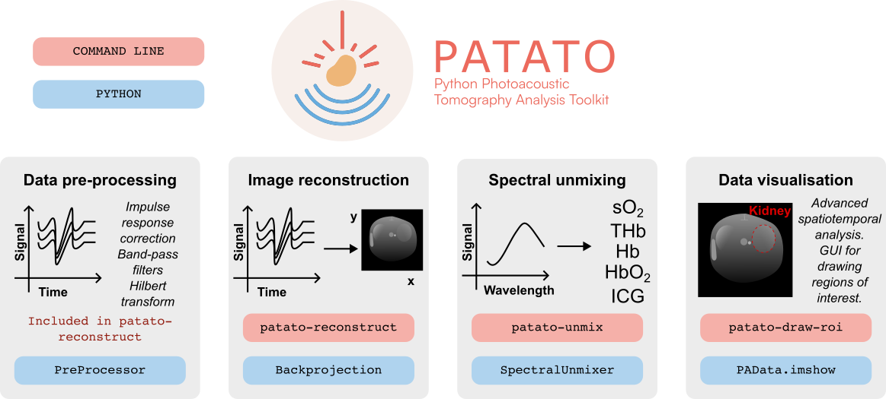

# Summary

Photoacoustic imaging (PAI) is an emerging scalable imaging technology that combines the high contrast of optical imaging with the spatiotemporal resolution of ultrasound [@Beard2011]. Using light absorption by endogenous molecules, such as haemoglobin in red blood cells, PAI can reveal the emergence of diseases ranging from inflammation to cancer in both preclinical animal models and in patients [@Brown2019; @Regensburger2021; @Wang2012; @Steinberg2019]. Extracting accurate photoacoustic imaging biomarkers, such as blood oxygen saturation, from raw data requires a robust image reconstruction and analysis process, which is challenging due to the high dimensionality of the data across spatial, spectral and temporal domains. Here we introduce PATATO,  a Python toolkit that offers fast implementations of commonly-used data analysis methods, including pre-processing, reconstruction and temporal data analysis, via a user-friendly command-line interface and Python API. The toolkit uses [JAX](https://jax.readthedocs.io/), a modern machine learning tool, for GPU-accelerated pre-processing and image reconstruction, and [NumPy](https://numpy.org/doc/stable/index.html) for easy integration with other commonly used Python libraries.  PATATO is open-source, hosted on [GitHub](https://github.com/BohndiekLab/patato) and [PyPi](https://pypi.org/project/patato/), and distributed under an MIT licence. We have designed PATATO to be modular and extendable to accommodate different data types, reconstruction methods, and custom analyses for specific scientific questions. We welcome contributions, bug reports, and feedback. Detailed examples, documentation, and an API reference are available at [https://patato.readthedocs.io/en/latest/](https://patato.readthedocs.io/en/latest/).

# Statement of Need

Photoacoustic imaging (PAI) contrast arises from the absorption of light pulses by tissue chromophores, such as haemoglobin, melanin, lipids and water [@Beard2011]. The acoustic waves that arise from the photoacoustic effect are then captured by a detector array, giving raw acoustic time series data associated with each light pulse. These raw data are typically subject to i) pre-processing e.g. by filtering; ii) reconstruction into 2D or 3D visualisations; iii) spectral unmixing processes, to decompose the range of molecules that contributed to the absorption process; and iv) data visualisation and quantification, including drawing of regions of interest (ROIs) to extract both static and dynamic biomarker values (\autoref{fig:overview}).

{ width=100% }

The PAI data processing pipeline is computationally intensive and the output values are highly susceptible to parameter changes [@Hochuli2019; @Shen2020]. Unfortunately, existing PAI data analysis typically relies on commercial software packages, or custom in-house unpublished codebases. Commercial software is generally optimised for image reconstruction from a specific instrument marketed by the vendor, enabling only a limited subset of predefined analyses and making analysis incompatible with open-access research mandates. Similarly, closed-source code reduces the transparency and reproducibility of research and impedes the widespread adoption of new algorithms. 

Some open access code for PAI backprojection and model-based reconstruction is available (pyoat, [https://github.com/berkanlafci/pyoat](https://github.com/berkanlafci/pyoat) and RAFT [@OKelly2021]). Still, implementation is restricted to a few use cases, documentation is limited and GPU acceleration lacking. Similar limitations exist for open access spectral processing code [@Kirchner2021; @Grohl2021].

We developed PATATO to enhance the transparency, reproducibility and consistency of PAI data analysis. PATATO is designed to be fast, extendable, and compatible with different data formats and systems, enabling users to easily go beyond the limited capabilities of commercial software packages and have complete control of their data processing pipeline. By providing an extendable platform for reproducible analysis, we hope to improve the uptake and dissemination of new analysis algorithms across both application-focused users and computational researchers, a goal that has garnered significant community support through the International Photoacoustic Standardization Consortium [@Grohl2022].

{ width=100% }

# Software Pipeline

PATATO is written in Python (currently supporting versions 3.9, 3.10 and 3.11) incorporating the strengths of standard numerical programming libraries, including NumPy, SciPy and matplotlib to access fast, well-tested numerical algorithms. PATATO can run without advanced hardware, as GPU dependencies are optional and memory requirements minimal, promoting accessibility and flexibility for the maximum number of users. 

Photoacoustic data can be large in size ($\gg$ 1 GB), impeding data import and data sharing. To enable fast handling of large datasets, PATATO implements batch processing and stores output in an HDF5 format, which allows seamless transfer of large data sets between fixed storage and memory. With HDF5, users can transfer data from PATATO to other tools and programming languages. PATATO includes dedicated wrappers for a number of data sources, e.g., for the IPASC data format [@Grohl2022], while also enabling user-defined wrappers.

PATATO features a modular design (\autoref{fig:softwareoverview}) reflecting the four main steps of PAI data processing (\autoref{fig:overview}).  Raw time-series pre-processing and backprojection [@Xu2005] are implemented using JAX, a high-performance numerical computing library that enables GPU acceleration. JAX uses the same code for CPUs and GPUs, removing potential inconsistencies between different platforms. PATATO enables linear spectral unmixing based on the NumPy matrix pseudo-inverse [@Hochuli2019], including reference optical absorption spectra for common chromophores such as deoxyhaemoglobin, oxyhaemoglobin and melanin, and the contrast agent indocyanine green (ICG) [@Prahl2018]. Users can adapt existing algorithms for any part of the processing pipeline or implement their own algorithms by extending the appropriate class.

# Strengths

PATATO is designed to be user-friendly. Users are not required to write code to use PATATO for typical image processing tasks. We also include command line tools for data importation, speed of sound optimisation, reconstruction, unmixing, temporal analysis, and region of interest analysis. Graphical user interfaces based on matplotlib are provided. Custom data processing algorithms can easily be added and examples are presented in the documentation.

# Limitations and caveats

Spectral analysis in PATATO is currently limited to linear spectral unmixing. This is an approximate method that does not account for changes in light fluence. 

Current data examples are restricted to 2D PAI, however, the reconstruction and analysis algorithms do support 3D data. 

# Example results

To demonstrate the main features and enable benchmarking of different algorithms, we have included a selection of data sets [@Else2023] with PATATO that were collected using a cylindrical-array pre-clinical (small animal) PAI system and a handheld clinical PAI system (MSOT inVision 256 and MSOT Acuity Echo respectively; both iThera Medical GmbH, Munich, Germany). Animal procedures were conducted under project licence PE12C2B96 and personal licence I33984279, issued under the United Kingdom Animals (Scientific Procedures) Act, 1986, and were approved locally under compliance form number CFSB2022. Detailed methods for this procedure have been published previously [@Tomaszewski2018].

The typical photoacoustic analysis procedure in PATATO can be illustrated using the mouse dataset described above. In this study, mice were implanted with tumours and photoacoustic images were acquired to interrogate the blood perfusion of the tumours. We perturbed the distribution of absorbing molecules in the mouse by changing the breathing gas to oxygen, thereby causing a change in the blood oxygenation, and by injecting the contrast agent indocyanine green (ICG). PATATO allows the streamlined analysis of such datasets (\autoref{fig:mice}). Firstly, we reconstructed the photoacoustic images by backprojection. We then drew polygon regions of interest around three regions of the mouse: the two implanted tumours and the spine (\autoref{fig:mice} A). To obtain maps of the blood oxygenation ($sO_2$), total haemoglobin (THb), and ICG content we applied linear spectral unmixing (\autoref{fig:mice} B). Plots of the $sO_2$ and $ICG$ levels in the three regions over time were made and the enhancement level was calculated (\autoref{fig:mice} C). Maps of the signal enhancement ($\Delta sO_2$ or $\Delta ICG$) were then made, revealing useful biomarkers related to hypoxia and blood perfusion respectively (\autoref{fig:mice}) [@Tomaszewski2018].  

![**An example of the analysis process in PATATO using a two-dimensional cross-sectional image of a tumour-bearing mouse.** Regions of interest were drawn around key features of the image, the spine and both tumours (A). We applied linear spectral unmixing, giving maps of the blood oxygenation ($sO_2$) and total haemoglobin (THb) (B). We acquired dynamic imaging data in response to changing breathing gas or contrast agent administration, showing the effects of oxygen enhancement or contrast enhancement respectively (C). We calculated two enhancement metrics, $\Delta sO_2$ and $\Delta \mathrm{ICG}$ (D). Scale bar = 5 mm. \label{fig:mice}](jossfig3.png){ width=100% }

# Future developments

PATATO will be developed on a continuous basis, and we welcome collaborative contributions from the PAI community, particularly to implement wrappers for different data formats and in adding image reconstruction and analysis tools. Contributions are particularly encouraged for model-based reconstructions and advanced spectral unmixing tools. 

# Acknowledgements

We would like to thank Mariam-Eleni Oraiopoulou, Ellie Bunce and Thierry Lefebvre for their helpful feedback as early users of the toolkit. This work was funded by: Cancer Research UK (SB, TRE; C9545/A29580); the MedAccel program of the National Physical Laboratory financed by the Department for Business, Energy and Industrial Strategy's Industrial Strategy Challenge Fund (LH); and the Walter Benjamin Stipendium of the Deutsche Forschungsgemeinschaft (JG). We would like to thank [Elly Pugh](https://ellypugh.com/) for design of the PATATO logo. 
